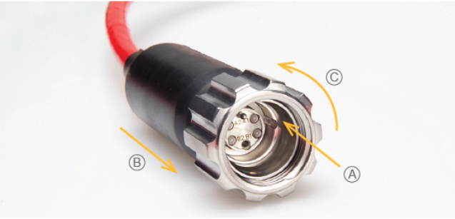
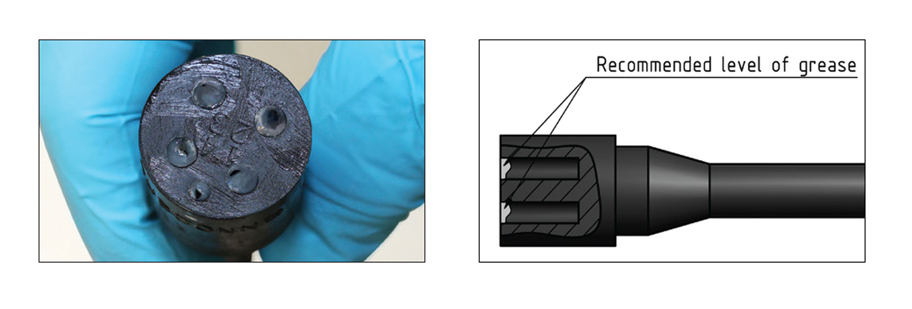
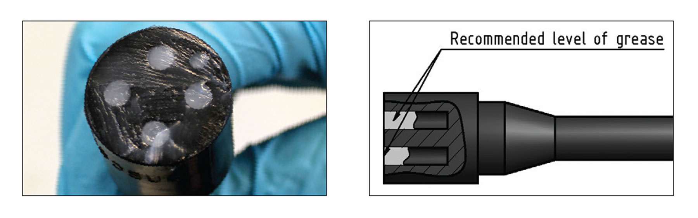
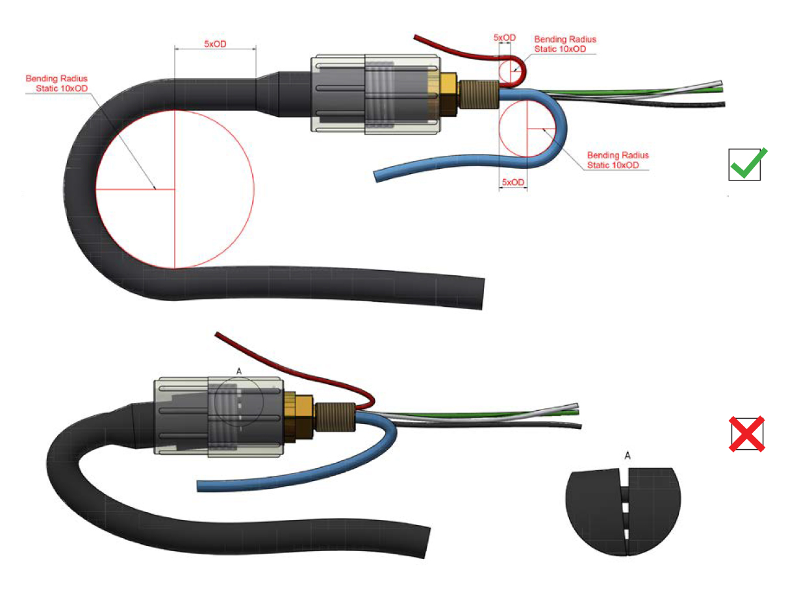

# Troubleshooting

## Fiber Optics

Inside the HabCam main electronics bottle there are four media converters: one for each camera, one for the data network (all other sensors, sonars, moxas, gardasofts, expansion bottle, and the chanos sensor), and a spare port not actively used. When the vehicle is powered on, full link lights on the front of each media converter indicate functional fiber optic connectivity per channel.

Multiple junctions (coupling points) exist throughout the system where improper seating or contamination will cause data loss.

---

### Connection Flowchart

```{mermaid}
graph TD
    subgraph Submerged ["<span style='color:#000000; font-weight:bold; float:left;'>Submerged Connections</span>"]
        Cam1_Sub["Cam1"]
        Cam2_Sub["Cam2"]
        Data_Sub["Data Network"]
        Spare_Sub["Spare"]

        Mux_Sub(["Multiplexer"])

        Cam1_Sub -->|Tx| Mux_Sub
        Cam1_Sub -->|Rx| Mux_Sub
        Cam2_Sub -->|Tx| Mux_Sub
        Cam2_Sub -->|Rx| Mux_Sub
        Data_Sub -->|Tx| Mux_Sub
        Data_Sub -->|Rx| Mux_Sub
        Spare_Sub -->|Tx| Mux_Sub
        Spare_Sub -->|Rx| Mux_Sub

        Bulkhead{"Fiber Optic Bulkhead"}
        FOCable{"Fiber Optic Cable"}
        OFJBox(["Oil Filled Junction Box"])

        Mux_Sub --> Bulkhead
        Bulkhead -->|Common Issue| FOCable
        FOCable --> OFJBox
    end

    WinchCable(("Winch Cable"))
    
    OFJBox --> WinchCable

    subgraph TopSide ["<span style='color:#000000; font-weight:bold; float:left;'>Top-side Connections</span>"]
        SlipRing(["Winch Slip Ring"])
        DryLabJBox(["Dry Lab Junction Box"])
        Mux_Top(["Multiplexer"])

        SlipRing -->|Common Issue| DryLabJBox
        DryLabJBox -->|Common Issue| Mux_Top

        Cam1_Top["Cam1"]
        Cam2_Top["Cam2"]
        Data_Top["Data Network"]
        Spare_Top["Spare"]

        Mux_Top -->|Tx| Cam1_Top
        Mux_Top -->|Rx| Cam1_Top
        Mux_Top -->|Tx| Cam2_Top
        Mux_Top -->|Rx| Cam2_Top
        Mux_Top -->|Tx| Data_Top
        Mux_Top -->|Rx| Data_Top
        Mux_Top -->|Tx| Spare_Top
        Mux_Top -->|Rx| Spare_Top
    end

    WinchCable --> SlipRing

    %% Diagram Styling
    style Submerged fill:#4a90e212,stroke:#4a90e2,stroke-width:1.5px,stroke-dasharray: 4 4
    style TopSide fill:#f5a62312,stroke:#f5a623,stroke-width:1.5px,stroke-dasharray: 4 4
    style Mux_Sub fill:#ffffff,stroke:#000000,stroke-width:2px
    style Mux_Top fill:#ffffff,stroke:#000000,stroke-width:2px
    style OFJBox fill:#ffffff,stroke:#000000,stroke-width:2px
    style SlipRing fill:#ffffff,stroke:#000000,stroke-width:2px
    style DryLabJBox fill:#ffffff,stroke:#000000,stroke-width:2px
    style WinchCable fill:#ffffff,stroke:#000000,stroke-width:2px
```


::: {.grid}

::: {.g-col-12 .g-col-md-6}
::: {.callout-warning appearance="simple"}
### Inspection Checklist
Carefully inspect designated high-failure points:

* **OptoLink bulkhead & mating cable** on the main electronics bottle
* **Ship's slip ring** assembly
* **Dry lab junction box to demultiplexer** interconnects
:::
:::

::: {.g-col-12 .g-col-md-6}
::: {.callout-note appearance="simple"}
### Cleaning Protocols
* **ST Connectors:** Clean using isopropyl alcohol and CLETOP fiber optic wipes. Use fiber optic insert cleaning pens for couplers.
* **Subconn OptoLink Series:** Ensure mating surfaces are dry and clean using **only** isopropyl alcohol and Kimtech wipes. Apply **Molykote Series 55** o-ring grease to o-rings.
:::
:::

:::

## OptoLink Connectors

Follow these instructions carefully to ensure correct use of your OptoLink connector and penetrator harnesses.[cite: 1]

---

### Assembly

#### OptoLink A-CCP to OptoLink A-FCR, BCR or CCR Receptacle

{.lightbox}

* A: Keyway visual alignment; B: Push connection path; C: Locking sleeve rotation direction.*

1. Inspect the connector face and O-rings. Grease the O-rings with Molykote 111.
2. Inspect the connector surface. If the connector surface is dirty, follow the OptoLink maintenance instructions below.
3. Visually align the key way on the CCP connector with the key pin tip on the receptacle before mating (illustration A).
4. Do not twist the connector to align it during mating. Push to mate the connector (illustration B).
5. Engage connector whilst turning the locking sleeve (illustration C).

::: {.callout-note appearance="simple"}
The connector must be hand tightened.
:::

---

### Maintenance

#### Receptacle Maintenance (A-CCP, A-FCR, BCR or CCR)

* **Dirty Lenses:** Clean with a dry cotton swab and isopropyl alcohol.
* **Greasy Lenses:** Clean with an isopropyl alcohol soaked cotton swab followed by a dry cotton swab. Repeat the cleaning process if necessary.
* **O-Ring Care:** Check O-rings before mating/mounting; replace if showing signs of damage. Always grease O-rings with Molykote 111.

::: {.callout-note appearance="simple"}
Always install dust caps when connectors are unmated.
:::

#### OptoLink Penetrator Harnesses

* O-rings must be checked before mounting and will require replacing if they show signs of damage.
* Always grease O-rings with Molykote 111.

---

### Torque & Mounting Specifications

#### Thread Locking
For locking metallic connectors, the use of Loctite 243 is recommended.

#### Bulkhead Connectors Tightening Force

| Type | Material | Rec. Torque (Nm) |
|---|---|---|
| 5/8"-18 UNF | Brass, aluminium | 29.0 |
| 5/8"-18 UNF | Stainless steel, titanium | 41.0 |
| 7/8"-14 UNF | Brass, aluminium | 60.0 |
| 7/8"-14 UNF | Stainless steel, titanium | 80.0 |

#### Pressure Balanced Systems
FCR and BCR are rated to 600 bar back pressure. MacArtney recommends DC-200/350 or PMX-200/350 in oil compensated systems.

## SubConn Connectors

Follow these handling instructions carefully to ensure correct operation and longevity of your SubConn underwater environment connectors.

---

### General Handling Guidelines

* **Greasing Standard:** Connectors must be greased with **MOLYKOTE 44 Medium** before every mating.
* **O-Ring Care:** Always grease O-rings on BH, BCR, and FCR connectors with **Molykote 111**.
* **Disconnect Technique:** Pull straight out when disconnecting; do not pull at an angle.
* **Cable Safety:** Do not pull directly on the cable and avoid sharp bends at the cable entry point.
* **Bulkhead Loads:** Ensure there are no angular loads on bulkhead connectors and apply recommended torque when tightening bulkhead nuts.
* **Environmental Exposure:** Do not expose connectors to extended periods of heat or direct sunlight. If a connector becomes very dry, soak it in fresh water before use.
* **Electrical & Sleeves:** All current ratings are based on the connector being submerged in water. The locking sleeve must be hand-tightened only.

---

### Greasing and Mating Procedures

::: {.grid}

::: {.g-col-12 .g-col-md-6}
::: {.callout-note appearance="simple"}
### Above Water (Dry-Mate)

{.lightbox}

1. Apply a layer of MOLYKOTE 44 Medium corresponding to a minimum of **1/10 of the socket depth** to the female connector.
2. Ensure the inner edge of all sockets is completely covered, leaving a thin layer of grease visible on the connector face.
3. Fully mate the male and female connectors to distribute grease across all contacts and sockets.
4. De-mate to verify grease coverage on every male pin, then re-mate.
:::
:::

::: {.g-col-12 .g-col-md-6}
::: {.callout-note appearance="simple"}
### Under Water (Wet-Mate)

{.lightbox}

1. Apply a layer of MOLYKOTE 44 Medium corresponding to approximately **1/3 of the socket depth** to the female connector.
2. Completely seal all sockets, leaving a transparent layer of grease visible on the connector face.
3. Fully mate the connectors underwater and wipe away any excess grease extruded from the joint.
:::
:::

:::

---

### Maintenance & Thread Locking

#### Cleaning Protocol
* **General Cleaning:** Remove accumulated contaminants using spray-based contact cleaner (Isopropyl alcohol) or liquid soap with hot water.
* **Re-Greasing:** Fresh MOLYKOTE 44 Medium must be re-applied prior to mating whenever connectors are cleaned.

#### Thread Locking Specifications
Ensure all threads and threaded holes are clean and completely free of foreign particles prior to application.

* **Metallic Connectors:** Apply **LOCTITE 243**.
* **Non-Metallic (PEEK) Connectors:** Apply **LOCTITE 5910**.

::: {.callout-warning appearance="simple"}
#### Critical PEEK Warning
Never use Acetone on PEEK non-metallic connectors, as it causes severe stress-induced cracking in the material.
:::

---

### Bending Radius & Coax Specifications

{.lightbox}

*Minimum static cable bend radius must be 10x cable diameter (top); avoid sharp bends at cable entry (bottom).*

#### Recommended Cable Bending Radius
* **Static Minimum Bend:** **10× Cable Outer Diameter ($10 \times \text{OD}$)**.
* Avoid sharp localized bends directly behind the connector strain relief boot.


#### Coax Connector Requirements
* **Mating Limit:** **Dry mating only**. Not suitable for open-face pressure or water-block applications.
* **Hardware:** Locking sleeves are strictly required, and dummy connectors must be installed whenever coax connectors are unmated.
* **Greasing Coax:** Avoid applying grease to the actual central coaxial contact. Grease only the outer rubber socket components. De-mate after greasing to verify no grease contaminated the coax center before final re-mating.

---

### Pressure Balanced Systems

* **Compensated Systems:** MacArtney recommends **DC-200/350** or **PMX-200/350** fluid in oil-compensated pressure-balanced systems.

## Vehicle Start-Up Flow Chart

graph TD
    %% Diagram Title Block
    Title["HabCam Troubleshooting Diagram:<br/><b>General Vehicle Set Up</b>"]

    %% Main Vehicle Startup Sequence (Left Spine)
    Pwr["Power on HabCam<br/>with 240V AC"]
    FO_Check{"Are fiber optics and<br/>data networks online?"}
    Eng_GUI["Start Engineering GUI"]
    Img_GUI["Start Image Viewer GUI"]
    Data_Verify["Verify images and<br/>vehicle data are being written"]
    Sonar_Start["Start BlueView and<br/>Side Scan Sonars"]

    %% Caution Note
    Sonar_Caution><b>Caution:</b><br/>Do not leave sonars running out of water,<br/>transducers may burn out]

    %% Right-side Action & Verification Checks
    FO_Action{"Check Fiber optic<br/>connectivity links"}
    Eng_Action{"Check Sensors, CruiseID,<br/>GPS, Fathometer"}
    Img_Action{"Start Stereo<br/>Acquisition Script"}
    Data_Action{"Check Dixon metadata<br/>directories /hab, /img<br/>Check mounted /tif directories"}
    Sonar_Action{"Connect to BlueView in ProViewer Software,<br/>Connect to Side Scan in Seanet Pro Software"}

    %% Reference Pages / Subroutines
    Ref_FO>See Troubleshooting<br/>Fiber Optics]
    Ref_Eng>See Troubleshooting<br/>Engineering GUI]
    Ref_Cam>See Troubleshooting<br/>Cameras]
    Ref_Data>See Troubleshooting<br/>vehicle data]
    Ref_Sonar>See Troubleshooting<br/>Sonars]

    %% Connections - Main Startup Flow
    Title --- Pwr
    Pwr --> FO_Check
    FO_Check -->|Yes| Eng_GUI
    Eng_GUI -->|Sensors online| Img_GUI
    Img_GUI -->|Cameras online| Data_Verify
    Data_Verify -->|Data is being written| Sonar_Start
    Sonar_Start -.-> Sonar_Caution

    %% Connections - Troubleshooting Branches
    FO_Check -->|No| FO_Action
    FO_Action -->|Issues?| Ref_FO

    Eng_GUI --> Eng_Action
    Eng_Action -->|Issues?| Ref_Eng

    Img_GUI --> Img_Action
    Img_Action -->|Issues?| Ref_Cam

    Data_Verify --> Data_Action
    Data_Action -->|Issues?| Ref_Data

    Sonar_Start --> Sonar_Action
    Sonar_Action -->|Issues?| Ref_Sonar

    %% Styling to match PDF color palette
    style Title fill:#d0e1fd,stroke:#4a90e2,stroke-width:2px
    classDef spine fill:#fce4ec,stroke:#ec407a,stroke-width:1.5px;
    classDef check fill:#e3f2fd,stroke:#29b6f6,stroke-width:1.5px;
    classDef ref fill:#bbdefb,stroke:#1e88e5,stroke-width:1.5px;
    classDef caution fill:#fff3e0,stroke:#fb8c00,stroke-width:1.5px;

    class Pwr,Eng_GUI,Img_GUI,Data_Verify,Sonar_Start spine;
    class FO_Check,FO_Action,Eng_Action,Img_Action,Data_Action,Sonar_Action check;
    class Ref_FO,Ref_Eng,Ref_Cam,Ref_Data,Ref_Sonar ref;
    class Sonar_Caution caution;

